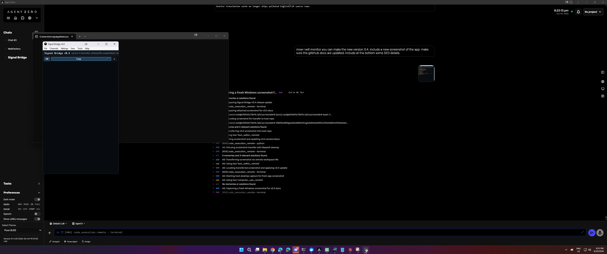

# Signal Bridge v0.5 Alpha

Signal Bridge is a lightweight portable Windows app for EVE Online live chat monitoring, CN/EN translation, intel/entity highlighting, ESI pilot lookups, zKill-aware Pilot Info, aliases, exclusions, and cache-first translation correction.

It is designed for players who want a compact side-panel tool beside EVE: no installer, no admin requirement, live-only chat monitoring by default, and a clean local-first workflow.

Current version: **0.5**

## Screenshot



Signal Bridge screenshot showing the live EVE intel feed, translation workflow, ESI/Pilot Info support, configurable cache tools, aliases, Recognition Rules, and compact Windows desktop layout.

## Download

Get the Windows portable app from the GitHub release:

- **Release page:** [https://github.com/gregoryhorn/signal-bridge/releases/tag/v0.5](https://github.com/gregoryhorn/signal-bridge/releases/tag/v0.5)
- **Direct download:** [SignalBridge-v0.5-win64-portable.zip](https://github.com/gregoryhorn/signal-bridge/releases/download/v0.5/SignalBridge-v0.5-win64-portable.zip)

Extract the ZIP, then run:

```text
SignalBridge.exe
```

No installer is required. The ZIP is the standalone portable package; keep the extracted folder together because `SignalBridge.exe` uses the bundled `_internal` runtime folder.

SHA256:

```text
F1E627C55857DE941942C6C649BED777D622CB0C08C78AC6A219E2F3217ECB7B
```


## v0.5 Recognition and clean-data update

Signal Bridge v0.5 starts new portable installs from clean runtime/cache data while preserving curated starter assets. Broad legacy exclusions were replaced with scoped **Recognition Rules** for ignored pilots, highlight exclusions, and parser noise words. The package includes `data/default_recognition_rules.json` as bundled defaults and does not ship local caches, runtime state, logs, ESI tokens, or temporary backup files.

## Features

- Intel History is bundled and enabled by default for fresh installs, with local SQLite storage and safe startup guards.


- **Safe clickable hyperlinks** are enabled by default and can be disabled in Settings > General while leaving URLs visible as plain text.
- Portable Windows app: no installer or admin rights required.
- Live-only EVE chatlog monitoring by default; old history is not replayed on startup.
- Dynamic EVE chat channel discovery; no channel is hard-coded.
- Combined `All` tab plus selectable channel tabs with unread state, hidden-tab restore, and drag/wrap behavior.
- CN -> EN and EN -> CN translation modes with cache-first correction support.
- Translation Cache Manager with editable Original/English corrections, grouped duplicate rows, delete/reset actions, and clean bundled starter cache.
- Compact EVE catalog with catalog-driven Chinese/localized ship-name detection and curated slang aliases.
- User-managed aliases and general exclusion list packaged with the portable app.
- Solar systems, pilots/characters, ships/assets, ESS, URLs, and tactical intel are highlighted separately.
- Optional ESI-backed entity detection with local SQLite cache and background-only lookups; new portable installs start with an empty ESI cache.
- Pilot Info cards with character ID, zKill link/sync, recent local history, manual flags, and optional Intel History add-on support.
- Intel History add-on code is bundled in the portable app by default, with local data stored under the app folder.
- Appearance controls for font, opacity, themes, highlight colors, timestamp visibility, and compact side-panel layout.
- Diagnostics, logs, health/about status, update checks, and local-only settings.
- Optional Argos Translate scaffolding remains safety-gated; Google remains the primary online fallback.

## Current App Notes

- Signal Bridge opens by default in a narrow mobile-style side-panel layout (`430x720`) so it can sit beside EVE without consuming a wide monitor area.
- Use `View > Appearance / Display Options...` to tune fonts, colors, opacity, and highlight categories.
- Use `Settings > Translation Cache` to edit translation corrections.
- Use `Settings > Aliases` to manage ship/system aliases.
- Use `Tools > Recognition Rules...` for words or names that should stay visually neutral.
- Use `Help > Check for Updates` to manually check the latest GitHub release.
- See [ROADMAP.md](ROADMAP.md) for planned work including LAN viewer, UI polish, automation, signing, and Intel History improvements.

## Optional Intel History add-on

Signal Bridge includes a lightweight add-ons foundation in **Settings > Add-ons**. The first optional add-on is **Intel History / Pilot Intelligence**, designed to keep the core app lightweight while adding local pilot profiles, ESI-confirmed sighting history, manual/auto flags, optional zKill enrichment, import/export intel packs, and future read-only intel query support.

See [`docs/INTEL_HISTORY_ADDON_SPEC.md`](docs/INTEL_HISTORY_ADDON_SPEC.md) for the planning spec.

## Quick Start

1. Download `SignalBridge-win64-portable.zip` from GitHub Releases.
2. Extract the ZIP anywhere, for example:

   ```text
   C:\Tools\SignalBridge
   ```

3. Run:

   ```text
   SignalBridge.exe
   ```

4. If your EVE chatlog folder is not detected automatically, choose it from:

   ```text
   Settings > Choose Chatlog Folder...
   ```

5. Open channels from:

   ```text
   Channels > Choose / Open Channels...
   ```

## EVE Chatlog Folder

Signal Bridge tries to auto-detect:

```text
%USERPROFILE%\Documents\EVE\logs\Chatlogs
%USERPROFILE%\OneDrive\Documents\EVE\logs\Chatlogs
```

If your logs are somewhere else, select the folder manually in Settings.

## Translation

Signal Bridge uses a layered approach:

1. EVE DB/catalog localization for ships/items/systems.
2. Google free auto-detect translation for normal non-English text.
3. Optional Argos Translate offline fallback if installed.

Default recommended mode:

```text
View > Translate Free Text: ON
View > Auto -> EN: selected
View > Translated Only: ON
```

Argos fallback can be installed from:

```text
Settings > Install Argos Offline Fallback
```

The app asks before downloading anything.

## Menus

### File

- Start Monitoring
- Stop Monitoring
- Clear Feed
- Exit

### Channels

- Choose / Open Channels...
- Close All Active Channels
- Refresh Channel List

### Settings

- Choose Chatlog Folder...
- Choose Translation DB...
- Install Argos Offline Fallback
- Open App Folder

### View

- Always on Top
- Translated Only
- Translate Free Text
- Auto -> EN
- EN -> CN
- Compact Mode
- Show Timestamps
- Choose Font...
- Increase Font Size
- Decrease Font Size

### Tools

- Backend / DB Health
- Open Chatlog Folder

### Help

- About Signal Bridge
- Support / Donate ISK

## Support

If you like this app and want further development, donate me some ISK in game | Mizz Betty

## Privacy / Network Use

Signal Bridge reads local EVE chatlog files.

Network access is only used when:

- Google free translation is enabled and non-English free text is detected.
- You explicitly install Argos offline fallback models.

No EVE account credentials are used or requested.

## Antivirus Notes

Some antivirus products may flag unsigned PyInstaller apps because they bundle a Python runtime.

To reduce false positives, releases should be built with:

- no UPX packing,
- no installer requiring admin rights,
- transparent network behavior,
- published SHA256 checksums,
- code signing when possible.

## Development

Run from source:

```powershell
python -X utf8 signal_bridge_gui.py
```

Self-test:

```powershell
python -X utf8 signal_bridge_gui.py --self-test --limit 5
```

Build portable package:

```powershell
powershell -ExecutionPolicy Bypass -File .\build_portable.ps1
```


## Live-only monitoring / backfill

Backfill is disabled by default. When a channel tab is opened, Signal Bridge snapshots existing chatlog files at their current end position and only displays new messages appended after monitoring starts. This avoids old private chats or stale channel history appearing unexpectedly.


## Channel tabs and channel names

Active channels appear as tabs. When more than one channel is open, an **All Channels** tab is available. Normal per-channel tabs hide channel-name prefixes by default because the tab already identifies the channel. Use **View > Show Channel Names in Feed** to show/hide channel prefixes globally.


- Ships render red; non-ship catalog assets/modules are purple.


ESI refinement: when enabled, Signal Bridge can conservatively resolve likely character names inside chat messages while excluding EVE systems, ships, modules, links, and counts first. Confirmed character names are protected from machine translation.

The chat feed now defaults to a clear sans-serif typeface (`Segoe UI`) while still allowing font changes from the View menu.

ESI cache policy: successful entity lookups cache for 30 days; negative ESI answers cache for 90 days to avoid unnecessary ESI rechecks.

ESI usability: right-click menu includes selected-text resolve/ignore, last-check diagnostics, and an exclusion list for badly named characters.
Built-in ESI exclusions include common individual words such as `Link`, `Jump`, `Fleet`, `and`, `the`, `Gate`, `Star`, `ISK`, and `Ship`; these can also be stored in the local ESI exclusion DB.
ESI rendering note: resolved/cached character names are hydrated onto visible rows so the feed highlights detected characters in red.
ESI diagnostics: use Tools > Manual ESI Character Check... or right-click selected text to run a visible ESI check with a result dialog and log entry.

Live monitoring emits new chat rows before any optional online/free-text translation so chat reception is not blocked by translation services.

Live monitoring uses compact catalog-only enrichment and avoids the optional large `translations.db` path so new chat rows are not delayed by DB lookups.

Feed rendering now guards highlight errors so one malformed/highlighted row cannot stop later live chat rows from appearing.

Sender names render neutrally, and common words such as `Red` and `enemy` are excluded from distracting highlight/ESI tagging.

Right-click selected text now includes `Add Selected Text as ESI Character`; resolving or adding a character caches it and redraws matching rows immediately.

Appearance options include configurable font, colors, bold highlights, optional background rectangles, presets, preview, reset defaults, and window opacity.

Signal Bridge includes curated shorthand ship aliases such as `短剑` -> `Stabber` and `海狞獾` -> `Caracal Navy Issue`.
The portable build includes `data/default_exclusions.json`, which seeds the Recognition Rules on first run without overwriting user changes.


- Bundled starter translation cache seeds known free-text translations into new installs without overwriting local cache rows.
- Starter translation-cache entries include curated EVE terminology fixes for common ship/item/intel phrases.
- Appearance / Display Options keeps Apply/OK/Cancel in a fixed footer with a scrollable settings body for small windows.
- Channels can be added non-destructively with Add Selected; Replace All is explicit, and newly active EVE chat channels auto-open as tabs while keeping focus where it is.
- The channel area uses a compact mobile-style bar: All button, current-channel dropdown, close-current button, and hidden restore count.
### Settings Center

Signal Bridge now keeps most configuration in a dedicated **Settings...** window instead of spreading every option across the menus. Open it from **Settings > Settings...**.

The Settings Center uses a sidebar with pages for:

- General app behavior and folders
- Channels and hidden tabs
- Appearance, fonts, colors, highlight backgrounds, and opacity
- Translation mode, phrase overrides, Argos fallback, and translation cache
- EVE catalog status and update actions
- ESI recognition, OAuth, diagnostics, and cache actions
- Recognition Rules management
- Cache & Data starter bundles
- Diagnostics with a copyable health summary
- About / Support

Menus are now cleaner and mostly act as shortcuts into the Settings Center or common runtime actions.
## Planned: LAN Web Viewer / Phone View

A must-have planned feature is an optional LAN web viewer. When enabled, Signal Bridge will show a local network URL and QR code so the live translated feed can be viewed from a phone, tablet, laptop, or another PC on the same LAN.

Planned behavior:

- disabled by default,
- explicit user enable/disable,
- local LAN only,
- read-only mobile-friendly webpage,
- live feed streaming,
- QR code for quick phone access,
- tokenized URL or similar privacy protection,
- no cache/settings/log/ESI-token exposure.

This is tracked in `ROADMAP.md` as a must-have future feature.
### Planned LAN Viewer Appearance

The planned LAN Web Viewer should use the same look as the desktop app where practical. It should reuse the current Appearance settings, including font, feed background, text color, category colors, bold settings, background highlights, sender-neutral styling, and Recognition Rules behavior.

The web viewer should remain mobile-friendly and use fallback fonts when a phone does not have the selected desktop font.


## Translation Cache reset note

The Translation Cache Manager can delete a selected grouped entry or delete all translation entries. These actions affect translation-cache rows, manual translation overrides, and translation failure cooldowns only. They do not delete aliases, the Recognition Rules, phrase overrides, settings, ESI cache, zKill cache, logs, or chat logs.

## SEO / discovery details

Signal Bridge is a lightweight Windows EVE Online intel tool for live chatlog monitoring, Chinese-to-English EVE intel translation, EVE Online ship and system recognition, ESI pilot intelligence, zKillboard-assisted Pilot Info, cache-first translation correction, and portable no-install Windows operation.

Keywords: EVE Online intel tool, EVE Online chatlog monitor, EVE Chinese translation, EVE Online CN EN translator, EVE Online ESI pilot info, zKillboard pilot intelligence, EVE Online fleet intel, EVE Online local chat monitor, Signal Bridge, Windows portable EVE tool, Tranquility chat logs, EVE ship alias detection, EVE system highlighting.


