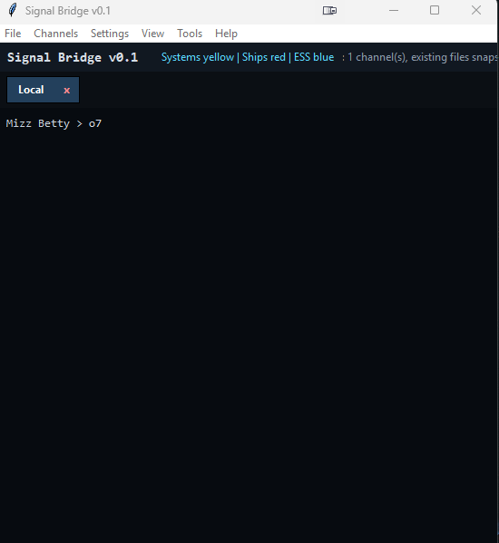

# Signal Bridge v0.1 Alpha version. I will make it better :) If you find bugs or want features log an issue here in githb.

Signal Bridge is a lightweight Windows app for translating chat logs CN -> EN and EN -> CN

## Version

Current version: 0.1

## Screenshot



Signal Bridge is a lightweight Windows desktop tool for monitoring EVE Online chat logs and making intel easier to read.

It watches selected EVE chat channels, highlights important entities, and can translate localized/non-English text while preserving EVE-specific terms.

## Features

- Portable Windows app: no installer required.
- Dynamic EVE chat channel discovery; no channel is hard-coded.
- Active channels appear as tabs; each tab has an `x` button to close/hide it.
- Solar systems highlighted in yellow.
- Ships/assets highlighted in red.
- `ESS` highlighted in light blue.
- EVE localization DB support for Chinese/localized ship names to English canonical names.
- Free Google auto-detect translation to English.
- Optional Argos Translate offline fallback.
- Optional EN -> CN mode.
- Always-on-top mode.
- Configurable font family, font size, and timestamp visibility.
- Saves settings locally in the portable app folder.

## Quick Start

1. Download `SignalBridge-win64-portable.zip` from GitHub Releases.
2. Extract the ZIP anywhere, for example:

   ```text
   C:\Tools\SignalBridge
   ```

3. Run:

   ```text
   SignalBridge.exe
   ```

4. If your EVE chatlog folder is not detected automatically, choose it from:

   ```text
   Settings > Choose Chatlog Folder...
   ```

5. Open channels from:

   ```text
   Channels > Choose / Open Channels...
   ```

## EVE Chatlog Folder

Signal Bridge tries to auto-detect:

```text
%USERPROFILE%\Documents\EVE\logs\Chatlogs
%USERPROFILE%\OneDrive\Documents\EVE\logs\Chatlogs
```

If your logs are somewhere else, select the folder manually in Settings.

## Translation

Signal Bridge uses a layered approach:

1. EVE DB/catalog localization for ships/items/systems.
2. Google free auto-detect translation for normal non-English text.
3. Optional Argos Translate offline fallback if installed.

Default recommended mode:

```text
View > Translate Free Text: ON
View > Auto -> EN: selected
View > Translated Only: ON
```

Argos fallback can be installed from:

```text
Settings > Install Argos Offline Fallback
```

The app asks before downloading anything.

## Menus

### File

- Start Monitoring
- Stop Monitoring
- Clear Feed
- Exit

### Channels

- Choose / Open Channels...
- Close All Active Channels
- Refresh Channel List

### Settings

- Choose Chatlog Folder...
- Choose Translation DB...
- Install Argos Offline Fallback
- Open App Folder

### View

- Always on Top
- Translated Only
- Translate Free Text
- Auto -> EN
- EN -> CN
- Compact Mode
- Show Timestamps
- Choose Font...
- Increase Font Size
- Decrease Font Size

### Tools

- Backend / DB Health
- Open Chatlog Folder

### Help

- About Signal Bridge
- Support / Donate ISK

## Support

If you like this app and want further development, donate me some ISK in game | Mizz Betty

## Privacy / Network Use

Signal Bridge reads local EVE chatlog files.

Network access is only used when:

- Google free translation is enabled and non-English free text is detected.
- You explicitly install Argos offline fallback models.

No EVE account credentials are used or requested.

## Antivirus Notes

Some antivirus products may flag unsigned PyInstaller apps because they bundle a Python runtime.

To reduce false positives, releases should be built with:

- no UPX packing,
- no installer requiring admin rights,
- transparent network behavior,
- published SHA256 checksums,
- code signing when possible.

## Development

Run from source:

```powershell
python -X utf8 signal_bridge_gui.py
```

Self-test:

```powershell
python -X utf8 signal_bridge_gui.py --self-test --limit 5
```

Build portable package:

```powershell
powershell -ExecutionPolicy Bypass -File .\build_portable.ps1
```


## Live-only monitoring / backfill

Backfill is disabled by default. When a channel tab is opened, Signal Bridge snapshots existing chatlog files at their current end position and only displays new messages appended after monitoring starts. This avoids old private chats or stale channel history appearing unexpectedly.


## Channel tabs and channel names

Active channels appear as tabs. When more than one channel is open, an **All Channels** tab is available. Normal per-channel tabs hide channel-name prefixes by default because the tab already identifies the channel. Use **View > Show Channel Names in Feed** to show/hide channel prefixes globally.


